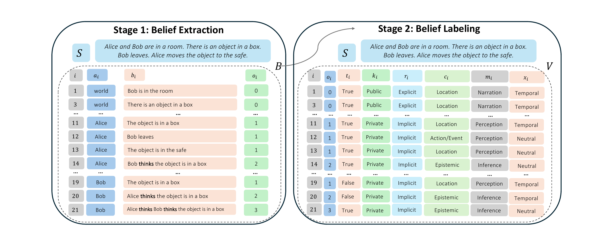
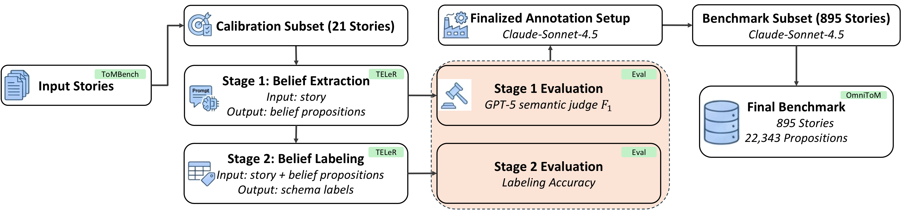
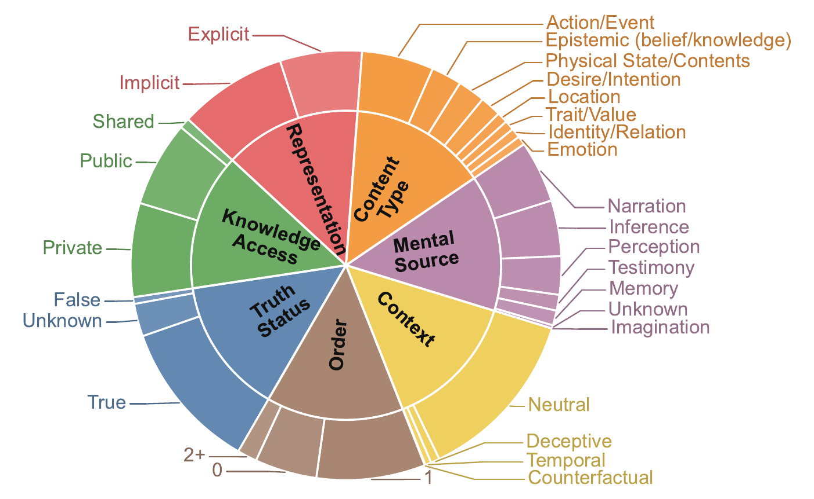

# OmniToM: Benchmarking Theory of Mind in LLMs via Explicit Belief Modeling

<p align="center">
  <a href="https://arxiv.org/abs/2605.26322"></a>
  <a href="https://adam-12-0.github.io/omnitom-project/"></a>
  <a href="https://github.com/Adam-12-0/omnitom-benchmark"></a>
  <a href="LICENSE"></a>
</p>

<p align="center">
  <b>Adam Bawatneh · Sagar Sapkota · Amrit Singh Bedi · Santu Karmaker · Mubarak Shah</b>
</p>

---

Social reasoning requires tracking how information is distributed across actors, not only what happened in the world. Existing Theory of Mind (ToM) benchmarks evaluate this ability through endpoint question answering: a model is scored by whether it produces the correct final answer, leaving the underlying mental-state representation entirely unobserved. A model can answer *"Where will Bob look?"* correctly while failing to track the belief states that make the answer valid.

**OmniToM** closes this gap through *explicit belief-structure modeling*. Rather than probing endpoints, OmniToM requires a model to reconstruct the full multi-actor belief representation of a story, then label each belief proposition along seven dimensions grounded in ATOMS, a literature-derived taxonomy of Theory of Mind abilities. This makes the hidden reasoning process visible and directly measurable.



## Benchmark at a Glance

| | |
|---|---|
| **Stories** | 895 |
| **Labeled belief propositions** | 22,343 |
| **Total schema labels** | 156,401 (22,343 × 7) |
| **Story categories** | 7 (from ToMBench) |
| **Human annotation effort** | 1,000+ person-hours |
| **Evaluation stages** | 2 (Extraction + Labeling) |

### Category Breakdown

| Category | Stories | Beliefs | Avg. beliefs/story |
| --- | ---: | ---: | ---: |
| Ambiguous Story Task | 98 | 4,614 | 47.08 |
| False Belief Task | 97 | 2,168 | 22.35 |
| Faux-pas Recognition Test | 142 | 3,981 | 28.04 |
| Hinting Task Test | 100 | 2,317 | 23.17 |
| Persuasion Story Task | 97 | 1,204 | 12.41 |
| Scalar Implicature Test | 154 | 3,251 | 21.11 |
| Strange Story Task | 207 | 4,808 | 23.23 |
| **Total** | **895** | **22,343** | **24.96** |

### Belief-Order Distribution

| Order | Share |
| --- | ---: |
| Order 0 (world facts) | 32.57% |
| Order 1 (actor beliefs) | 57.12% |
| Order 2+ (nested beliefs) | 10.32% |

## Evaluation Protocol

OmniToM evaluates two linked tasks under zero-shot TELeR Level 3 prompts:

**Stage 1, Belief Extraction:** Given a story, extract all relevant `(Actor, Belief, Order)` tuples. Scored by a GPT-5 semantic judge using precision, recall, and F1 over matched propositions.

**Stage 2, Belief Labeling:** Given a story and the benchmark belief table, assign a seven-dimensional schema label vector to each belief. Scored by exact-match accuracy per dimension, averaged over all propositions.

The seven schema dimensions are: **Order · Truth Status · Knowledge Access · Representation · Content Type · Mental Source · Context**





## Results

### Main Benchmark Results (Zero-Shot, TELeR L3)

Stage 1 reports category-wise and overall macro F1. Stage 2 reports per-dimension and overall macro belief-labeling accuracy. GPT-5 is omitted from Stage 1 because it serves as the semantic judge. **Bold** = best, <u>underline</u> = second-best.

#### Stage 1, Belief Extraction F1 (%)

| Model | Params | AST | FBT | FPT | HT | PST | SIT | SST | **Overall** |
| --- | --- | ---: | ---: | ---: | ---: | ---: | ---: | ---: | ---: |
| **Closed-source** | | | | | | | | | |
| Gemini-2.5 Flash | N/A | 42.40 | 56.48 | **57.78** | **50.34** | **58.55** | 62.91 | **56.31** | **54.97** |
| GPT-5 | N/A | N/A | N/A | N/A | N/A | N/A | N/A | N/A | N/A |
| **Open-weight** | | | | | | | | | |
| Gemma-3 27B | 27B | **48.72** | **72.39** | 56.05 | 45.46 | 56.72 | **68.76** | **55.77** | **57.69** |
| Mistral-Small 24B | 24B | **52.97** | 54.58 | **59.79** | **48.32** | 56.97 | **66.20** | 53.17 | **56.00** |
| Mistral-Large 123B | 123B | 47.75 | **71.28** | 53.66 | 41.78 | **58.53** | 57.38 | 48.35 | 54.10 |
| Qwen3 32B | 32B | 46.88 | 57.32 | 53.38 | 41.41 | 57.25 | 56.51 | 48.67 | 51.63 |
| Llama-3.3 70B | 70B | 37.51 | 64.07 | 46.33 | 36.27 | 47.23 | 57.70 | 41.58 | 47.24 |
| Qwen3 8B | 8B | 39.12 | 50.22 | 44.21 | 37.14 | 48.36 | 47.20 | 37.60 | 43.41 |
| Llama-3.1 8B | 8B | 26.34 | 48.29 | 35.80 | 31.48 | 36.12 | 53.52 | 30.37 | 37.42 |

#### Stage 2, Belief-Labeling Accuracy (%)

| Model | Order | Status | Access | Repr | CType | Source | Context | **Overall** |
| --- | ---: | ---: | ---: | ---: | ---: | ---: | ---: | ---: |
| **Closed-source** | | | | | | | | |
| Gemini-2.5 Flash | 95.56 | **84.97** | 71.34 | **87.58** | **85.97** | 84.10 | **92.14** | **85.95** |
| GPT-5 | 95.18 | 82.72 | 66.85 | **83.42** | 79.96 | 83.02 | 88.83 | 82.85 |
| **Open-weight** | | | | | | | | |
| Mistral-Large 123B | **97.25** | **86.53** | **74.14** | 72.87 | **82.83** | **86.32** | **92.97** | **84.70** |
| Mistral-Small 24B | 95.13 | 82.22 | **74.59** | 62.79 | 76.01 | **84.82** | 91.90 | 81.06 |
| Llama-3.3 70B | 92.74 | 83.55 | 67.41 | 72.43 | 72.35 | 76.71 | 91.69 | 79.55 |
| Qwen3 32B | 96.42 | 82.43 | 73.91 | 62.45 | 71.27 | 76.84 | 90.81 | 79.16 |
| Gemma-3 27B | **96.56** | 82.44 | 71.57 | 54.33 | 73.50 | 78.72 | 92.07 | 78.46 |
| Qwen3 8B | 73.38 | 67.17 | 57.94 | 63.77 | 51.43 | 61.49 | 74.62 | 64.26 |
| Llama-3.1 8B | 71.90 | 65.59 | 56.13 | 64.40 | 48.63 | 55.18 | 76.81 | 62.66 |

### Key Finding: Actor-Specific Information Tracking is the Core Bottleneck

OmniToM localizes a consistent failure mode across both stages. **Stage 1** extraction F1 drops sharply as belief order increases: models can identify world facts (Order 0) but struggle to assign those facts to the correct actor's information state (Order 1) and further degrade on nested beliefs (Order 2+). **Stage 2** labeling errors concentrate on *Knowledge Access* (56-75%) and *Representation* (54-88%), the two dimensions that require a model to determine who could know or share a belief, and whether the belief is explicitly stated or inferred from perception, testimony, memory, or context.

The gap between the two stages is also diagnostic: models label provided belief propositions far better (up to 85.95%) than they extract those propositions from raw text (up to 57.69%). This shows that current LLMs are much better at operating over an explicit belief structure once it is given than at constructing that structure directly from story text, a distinction invisible to endpoint QA benchmarks.

## Dataset Format

Each line of `benchmark_story_belief_labels.jsonl` is one JSON object:

```json
{
  "story_id": 1,
  "story_category": "Ambiguous Story Task",
  "story": "Story text...",
  "beliefs": [
    {
      "actor": "world",
      "belief": "A minimal propositional statement.",
      "labels": {
        "order": "0",
        "truth_status": "True",
        "knowledge_access": "Public",
        "representation": "Explicit",
        "content_type": "Action/Event",
        "mental_source": "Narration",
        "context": "Neutral"
      }
    }
  ]
}
```

## Included Files

| File | Description |
| --- | --- |
| `benchmark_story_belief_labels.jsonl` | Benchmark dataset, one JSON object per story |
| `benchmark_prompting.py` | Helpers for loading stories and reconstructing benchmark tables |
| `prompts_extract.py` | Stage 1 extraction prompt builder |
| `prompts_label.py` | Stage 2 labeling prompt builder |
| `prompt_evaluate.py` | Semantic-judge prompt builder with three judge examples |
| `run_replication.py` | End-to-end experiment and evaluation runner |
| `HF_DATASET_CARD.md` | Dataset card for dataset-hosting platforms |
| `LICENSE` | License for the OmniToM release package |

## Quick Prompt Usage

```python
from benchmark_prompting import load_story_record
from prompts_extract import build_extract_messages
from prompts_label import build_label_messages
from prompt_evaluate import build_evaluation_messages

record = load_story_record(1)
extract_system, extract_user = build_extract_messages(1)
label_system, label_user = build_label_messages(1)

predictions_csv = 'Actor,Belief\nworld,Example belief\n'
judge_system, judge_user = build_evaluation_messages(1, predictions_csv, fewshots=3)
```

## Installation

For the mock smoke test, Python `3.10+` and the standard library are sufficient. For model runs:

```bash
pip install -r requirements.txt
```

Configure credentials via environment variables:

```bash
export OPENAI_API_KEY="..."
export GOOGLE_API_KEY="..."
# For OpenAI-compatible endpoints:
export OPENAI_BASE_URL="https://your-endpoint.example/v1"
```

## Running the Experiments

**Smoke test** (no API required):

```bash
python run_replication.py --backend mock --output-dir runs/mock_smoke
```

**Open-weight model** (Stage 1 + Stage 2):

```bash
python run_replication.py \
  --backend hf \
  --model meta-llama/Llama-3.3-70B-Instruct \
  --load-in-4bit --bnb-4bit-compute-dtype bf16 \
  --stages extract label \
  --output-dir runs/llama33_70b
```

**API model** (Stage 1 + Stage 2):

```bash
python run_replication.py \
  --backend api \
  --api-provider google_genai \
  --model gemini-2.5-flash \
  --stages extract label \
  --output-dir runs/gemini25_flash
```

**GPT-5 Stage 2 labeling only** (GPT-5 is the judge, so is excluded from Stage 1):

```bash
python run_replication.py \
  --backend api --api-provider openai \
  --model gpt-5 --stages label \
  --output-dir runs/gpt5_stage2
```

**Semantic judge + metrics** (after Stage 1 extraction exists):

```bash
python run_replication.py \
  --backend api --api-provider openai \
  --judge-model gpt-5 --judge-fewshots 3 \
  --stages judge metrics \
  --output-dir runs/llama33_70b
```

Useful flags: `--story-ids 1,2,5-7` · `--max-stories 25` · `--overwrite` · `--no-story-context` · `--max-new-tokens 6000` · `--temperature 0`

## Output Layout

```
<output-dir>/
  manifest.json
  extraction/raw/  extraction/csv/
  labeling/raw/    labeling/csv/
  judge/raw/       judge/csv/
  metrics/
    stage1_story_metrics.csv   stage1_overall.csv   stage1_by_category.csv
    stage2_story_metrics.csv   stage2_overall.csv   stage2_by_category.csv
```

## Important Notice

OmniToM is released for evaluation and analysis. To limit benchmark contamination, please use the released stories for benchmarking rather than training.

## Citation

```bibtex
@article{bawatneh2026omnitom,
  title     = {OmniToM: Benchmarking Theory of Mind in LLMs via Explicit Belief Modeling},
  author    = {Bawatneh, Adam and Sapkota, Sagar and Bedi, Amrit Singh and Karmaker, Santu and Shah, Mubarak},
  journal   = {arXiv preprint arXiv:2605.26322},
  year      = {2026}
}
```

## License and Attribution

The OmniToM release package is distributed under the license in `LICENSE`.

Story text is derived from ToMBench (MIT License, Copyright 2024 Zhuang Chen):

- Repository: [`zhchen18/ToMBench`](https://github.com/zhchen18/ToMBench)
- Paper: "ToMBench: Benchmarking Theory of Mind in Large Language Models" (ACL 2024)

OmniToM adds new benchmark annotations, prompt builders, replication code, and release documentation on top of the ToMBench story corpus.
